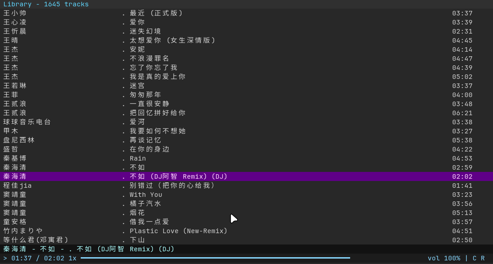

# termus

Small, fast terminal music player. Inspired by [cmus](https://github.com/cmus/cmus).



## Documentation

Start here if you are trying to understand or work on this repository:

- [docs/README.md](docs/README.md): documentation index and suggested reading order
- [docs/project-structure.md](docs/project-structure.md): repository layout, source tree ownership, and cleanup guidelines
- [docs/contributing.md](docs/contributing.md): repository rules, code placement, and contribution checklists
- [docs/architecture.md](docs/architecture.md): runtime architecture, threads, plugins, and subsystem boundaries
- [docs/development.md](docs/development.md): build, test, and development workflow
- [docs/runtime.md](docs/runtime.md): config directory, autosave, socket, and runtime state
- [docs/tui.md](docs/tui.md): ncurses screen layout, views, input modes, and UI implementation map

## Repository Shape

The source tree is already split by responsibility:

```text
src/app        process setup, entry points, option state/registry
src/common     low-level shared helpers
src/core       playback pipeline, metadata, codecs, transport
src/ipc        remote control and desktop integration
src/library    library, playlists, filters, search
src/plugins    runtime-loaded input/output plugins
src/ui         ncurses UI and presentation logic
docs/          contributor-facing project documentation
tests/         low-level regression tests run by make check
```

What usually makes this repository feel noisy is not the source split itself,
but the mix of:

- generated Autotools files at the top level
- one or more out-of-tree build directories such as `build/`
- work-in-progress scratch artifacts during refactors

That distinction is documented in [docs/project-structure.md](docs/project-structure.md).

## Build

Bootstrap Autotools once after clone:

```sh
autoreconf --force --install --verbose
```

Build out of tree:

```sh
mkdir -p build
cd build
../configure
make
```

After that, ordinary source changes only need:

```sh
cd build
make
```

Rerun extra steps only when needed:

- Changed `configure.ac` or any `Makefile.am`: rerun `autoreconf --force --install --verbose`, then `../configure`, then `make`.
- Changed configure flags or dependency environment: rerun `../configure`, then `make`.
- Remove `build/` only when you want a clean rebuild or the build tree is inconsistent.

On some BSD systems, use `gmake` instead of `make`.

## Install

```sh
make install
```

Package staging:

```sh
make install DESTDIR=/tmp/termus-pkg
```

## Dependencies

Required:

- C compiler (C11 or newer)
- GNU make, autotools, pkg-config
- ncurses, iconv, pthreads

Primary audio format libraries (required by default, disable with `--disable-*`):

| Library | Package (Debian/Ubuntu) | Format |
|---------|------------------------|--------|
| libFLAC | `libflac-dev` | FLAC lossless |
| opusfile | `libopusfile-dev` | Opus in Ogg |
| faad2 | `libfaad-dev` | Raw AAC |
| mp4v2 + faad2 | `libmp4v2-dev libfaad-dev` | M4A / MP4 |

Auto-detected (soft dependency):

| Library | Package | Format |
|---------|---------|--------|
| libvorbisfile | `libvorbis-dev` | Ogg Vorbis |
| libmpg123 | `libmpg123-dev` | MP3 (legacy) |

Output backend (auto-detected by platform):

| Library | Platform |
|---------|----------|
| PipeWire (`libpipewire-0.3`) | Linux primary |
| ALSA (`alsa`) | Linux fallback |
| CoreAudio | macOS |
| OSS | FreeBSD |
| sndio | OpenBSD |

Use `../configure --help` in the build directory to see all options.

## Manuals

```sh
man termus
man termus-tutorial
```

## Development Notes

- Maintain `configure.ac` and `Makefile.am`.
- Do not hand-edit generated files such as `configure`, `Makefile.in`, or `Makefile`.
- Prefer out-of-tree builds.
- Follow the existing C style and use hard tabs.

